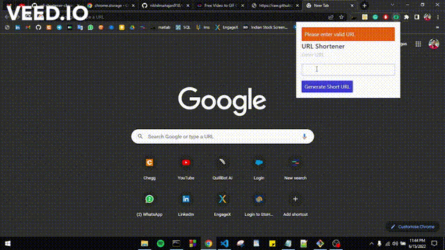

## Overview

This chrome extension helps user to shorten the long URL's.

### The challenge

Functionality of this chrome extension is to: 

- Shorten any valid URL
- Send an error message when the `form` is submitted if:
  - The `input` field is empty
- Send an success message when the `form` is submitted if:
  - The `input` field is filled with URL
- A loading icon will be displayed till the URL link shortens

### This is how the extension looks like:

### Built with

- [Spectre.CSS](https://picturepan2.github.io/spectre/)
- [javascript](https://developer.mozilla.org/en-US/docs/Web/JavaScript)

## About the author

[LinkedIn - Nikhil Mahajan](https://www.linkedin.com/in/nikhil-mahajan-92b9631a0/ "Nikhil Mahajan's LinkedIn profile")

[Web - Nikhil Mahaan](https://nikhilmahajan.netlify.app/ "Nikhil Mahajan Portfolio")
